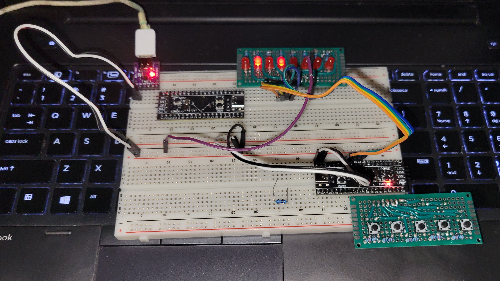

# Black Pill -- Four Bit Toggle

---

## Introduction

This is a culmination of weeks and weeks of work. Not only work
on the software development, but also the hardware design. I've 
dabbled, albeit slightly, in circuit design, and have been 
studying Ohm's law. It's been becoming more and more easy for 
me to understand what's going on in a circuit, and how I might 
solder up the leads, to get such a circuit working. 

I started with a couple modules, first one with a couple LEDs, 
then one with a couple buttons. I took it to the next step, 
with a board that had eight LEDs on it, and of course eight 
resistors, and a 9-pin header, to include a ground. 

After some careful work, and practice with my soldering iron,
I was able to fashion a five button input device, with a 7-pin
header. Five input pins, power, and ground. This one was
considerably more difficult to work with, but I'm happy with 
the results.

---

## Software 

The software used for this project includes the Arduino Library
as well as Platformio for compilation and deployment. This is 
sort of in-between software and firmware, but I'm also using an
ST-Link to talk to my BlackPill via SWD (Serial Wire Debug). One 
could just as easily use a regular UART to USB Serial Adapter, 
and it would work just as fine. 

---

## Hardware

 + STM32F411CEU6 - BlackPill V2 (WeAct Studio)
 + Five-Bit Input Device (5 Buttons)
 + Eight-Bit Output Device (8 LEDs)
 

---

## Purpose 

The purpose of this project was to assemble the required 
items, to get things ready to integrate my Abstract Logic
Circuits library I wrote in the Fall of 2022. That should 
be one of my upcoming repos, which I'm very excited to 
work on. We shall see, how it goes.  
